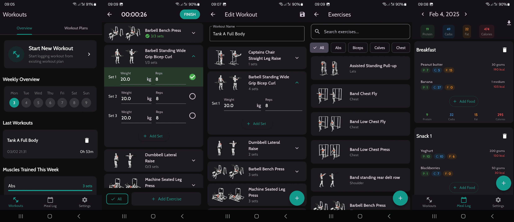

# HorFit

HorFit is an open-source Android Workout tracker and Meal tracker built with Flutter.

### Workout tracker
With Horfit you can create workout plans by adding exercises and tracking weights and repetitions. There is a huge selection of more than 3000 exercises to choose.
After creating workout plans, you can start a new workout log while you are in the gym. With it you can log track your exercises, weights and repetitions.
You can also create new exercises if you can't find what you need.

### Meals and Macros tracking
There is also a Meal Log section where you can track all your macros for the day (calories, protein, fat and carbs). 
You can create Food plans and different foods (than the ones which are there by default).

### Functionalities
- Creating Workout Plans with exercises, weight and reps
- Starting a new Workout based on an existing workout plan
- Tracking the workout during training with time tracking and all exercises, weights, reps
- More than 3000 exercises with images
- New exercise creation
- Creating Meal plans with different meal types and possibility to add foods
- Meal Log with macros tracking
- More than 150 foods with macros
- New foods creation
- Change between kg and lb
- Export DB using the sharing feature so you can use the file explorer to select where to store the db
- Import and existing DB
- Reset DB (deletes all user data)

### Other
It is specifically built and tested for Android (IOS is not tested and probably needs some tweaks).
